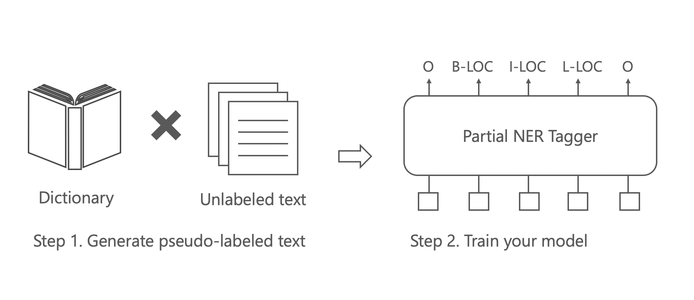

# spacy-partial-tagger

This is a CRF tagger for partially annotated dataset in spaCy. You can build your 
own NER tagger only from dictionary. The algorithm of this tagger is based on Effland and Collins. (2021).


## Overview




## Dataset Preparation

Prepare spaCy binary format file. This library expects tokenization is character-based.
For more detail about spaCy binary format, see [this page](https://spacy.io/api/data-formats#training).

You can prepare your own dataset with [spaCy's entity ruler](https://spacy.io/usage/rule-based-matching#entityruler) as follows:

```py
import spacy
from spacy.tokens import DocBin
from spacy_partial_tagger.tokenizer import CharacterTokenizer


nlp = spacy.blank("en")
nlp.tokenizer = CharacterTokenizer(nlp.vocab)  # Use a character-based tokenizer

patterns = [{"label": "LOC", "pattern": "Tokyo"}, {"label": "LOC", "pattern": "Japan"}]
ruler = nlp.add_pipe("entity_ruler")
ruler.add_patterns(patterns)

doc = nlp("Tokyo is the capital of Japan.")

doc_bin = DocBin()
doc_bin.add(doc)

# Replace /path/to/data.spacy with your own path
doc_bin.to_disk("/path/to/data.spacy")
```

## Training

Train your model as follows:

```sh
python -m spacy train config.cfg --output outputs --paths.train /path/to/train.spacy --paths.dev /path/to/dev.spacy --gpu-id 0
```

You could download `config.cfg` [here](https://github.com/tech-sketch/spacy-partial-tagger/blob/main/config.cfg).
Or you could setup your own. This library would train models through spaCy. If you are not familiar with spaCy's config file format, 
please check the [documentation](https://spacy.io/usage/training#config).

Don't forget to replace `/path/to/train.spacy` and `/path/to/dev.spacy` with your own.

## Evaluation

Evaluate your model as follows:

```sh
python -m spacy evaluate outputs/model-best /path/to/test.spacy --gpu-id 0
```

Don't forget to replace `/path/to/test.spacy` with your own.

## Installation

```sh
pip install spacy-partial-tagger
```

If you have problems installing `pytokenizations`, please check [this website](https://rustup.rs/) and install Rust.

## References

- Thomas Effland and Michael Collins. 2021. [Partially Supervised Named Entity Recognition via the Expected Entity Ratio Loss](https://aclanthology.org/2021.tacl-1.78/). _Transactions of the Association for Computational Linguistics_, 9:1320–1335.
